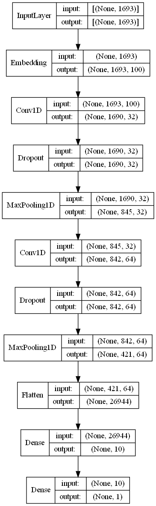

# Polarity Detection on Movie Review Dataset using CNN
In this notebook we use NLP techniques to clean and preprocess the data. After that, we build a CNN to predict polarity of each document.

Increase the data to get a better result

[Dataset](https://www.cs.cornell.edu/people/pabo/movie-review-data/)

## Contents
### Data Understanding
There are 2000 reviews belonging to 2 classes.
Each document is a review and it can be negative or positive.

Maximum number of words for positive reviews is 1693 and for negative reviews is 1400. We need this information for text padding.

### Data Cleaning
Here we load the documents and assign each one a target. We assign 0 to negative reviews and 1 to positive ones.

Other actions:
* Punctuation removal
* Stopwords removal
* Word tokenization
* Train-test split
  * 1600 documents for train and 400 documents for test

### Data Preprocessing
* Tokenizing
* Encoding
* Text padding

### Modeling
We use the following model

